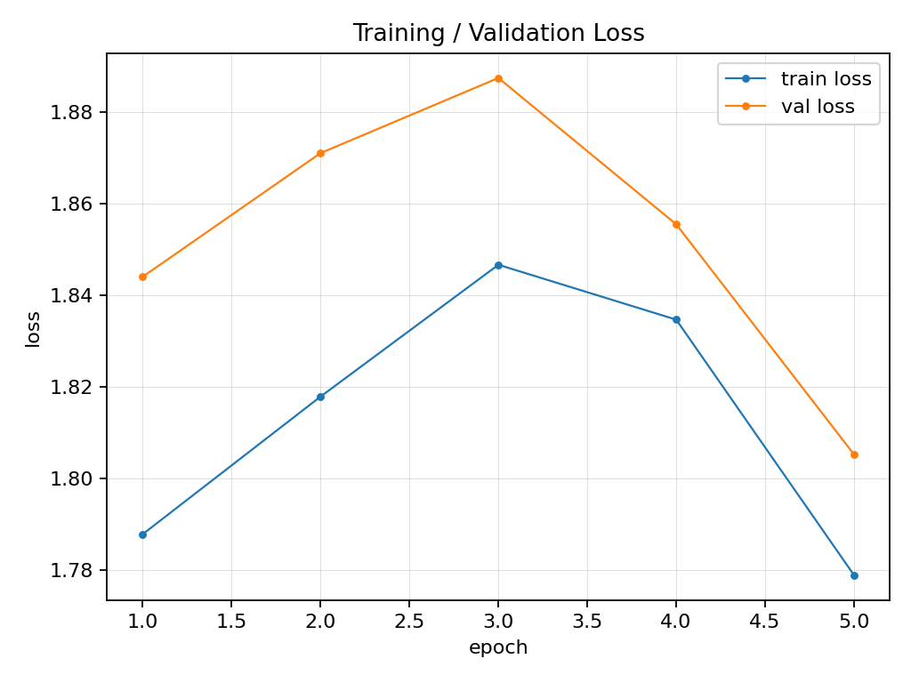
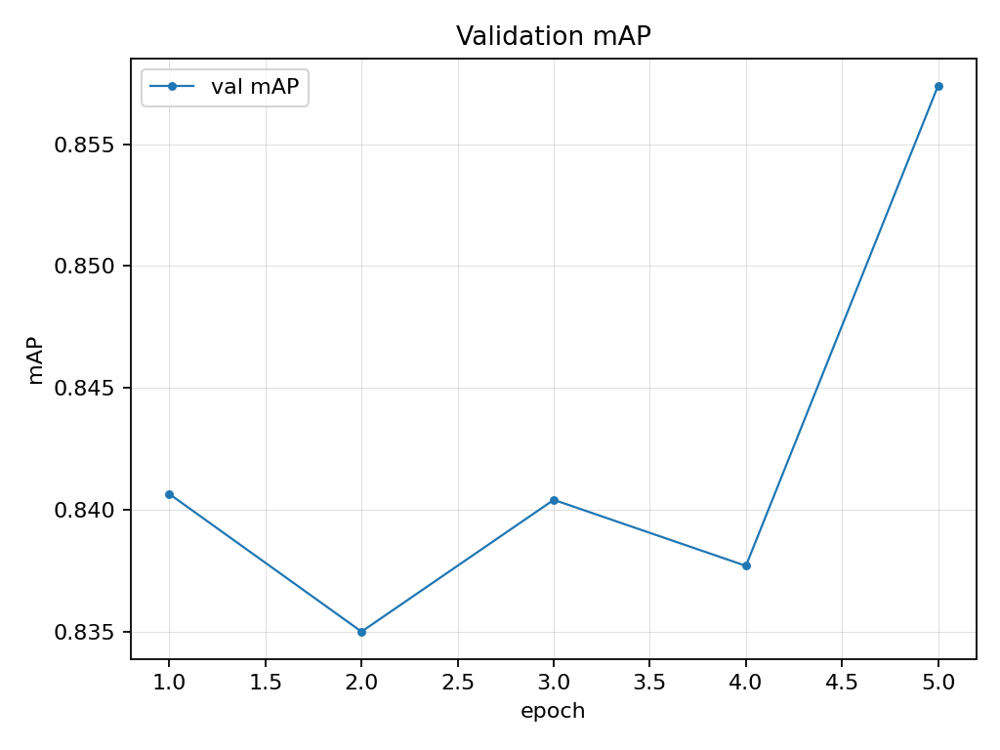
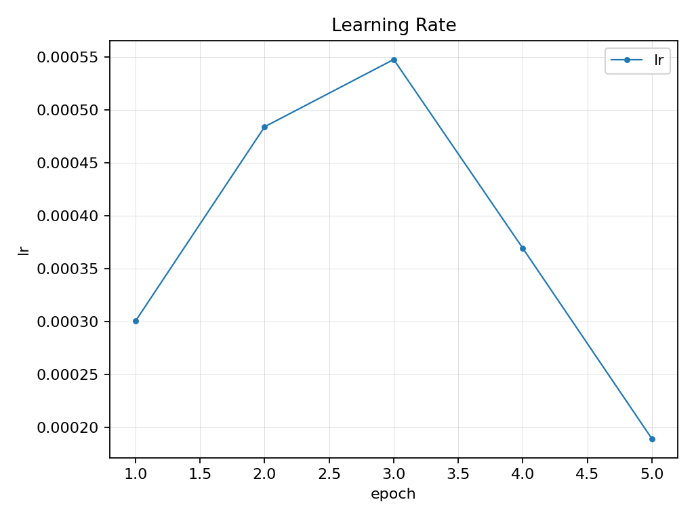

# indoor_object_detection / original / best / experiment_1

## Configuration
dataset: indoor_object_detection
lv2_name: original
lv3_name: best
lv4_name: experiment_1
model: /home/francisco/workspace/personal_projects/docusketch_assignment/work_dirs/indoor_object_detection/original/yolov8n/experiment_2/ckpts/best.pt
epochs: 5
imgsz: 640
batch: 16
device: 0
seed: 42
data_yaml: /home/francisco/workspace/personal_projects/docusketch_assignment/prepared_data/yolo_indoor_object_detection/indoor.yaml
framework: ultralytics-yolov8
augment.hsv_h: 0.015
augment.hsv_s: 0.7
augment.hsv_v: 0.4
augment.degrees: 0.0
augment.translate: 0.1
augment.scale: 0.5
augment.shear: 0.0
augment.perspective: 0.0
augment.flipud: 0.0
augment.fliplr: 0.5
augment.mosaic: 1.0
augment.mixup: 0.0
augment.cutmix: 0.0
augment.close_mosaic: 10

## Training curves

## Overlays

## Test results
mAP: 0.841
AP50: 0.983
AP75: 0.953
precision: 0.967
recall: 0.967

**Comparison vs best sibling:** — *Only experiment* (mAP=0.841)